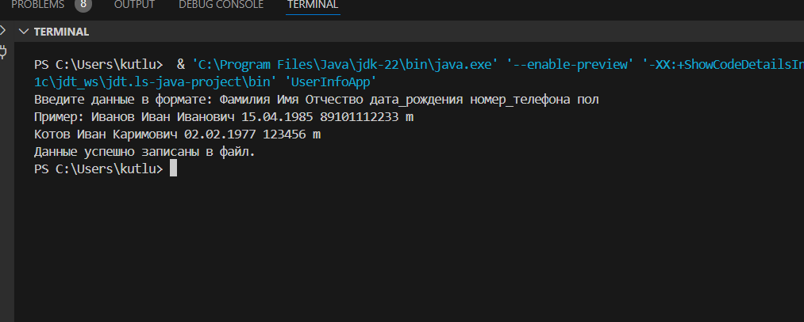

# Промежуточная аттестация
## Исключения в программировании и их обработка

## Задача
- Написать приложение, которое будет запрашивать у пользователя следующие данные разделенные пробелом:
  Фамилия Имя Отчество датарождения номертелефона пол
- Форматы данных:
фамилия, имя, отчество - строки
дата_рождения - строка формата dd.mm.yyyy
номер_телефона - целое беззнаковое число без форматирования
пол - символ латиницей f или m.
- Приложение должно проверить введенные данные по количеству. Если количество не совпадает с требуемым, показать пользователю сообщение, что он ввел неправильные данные.
- Если форматы данных не совпадают, пользователю выведено сообщение с информацией, что именно неверно.
- Если всё введено и обработано верно, должен создаться файл с названием, равным фамилии, в него в одну строку должны записаться полученные данные, вида
<Фамилия><Имя><Отчество><датарождения> <номертелефона><пол>
- Однофамильцы должны записаться в один и тот же файл, в отдельные строки.

### Решение:

1. Создан репозиторий: **books**

2. Текстовое описание решения (файл **README.md**)

3. Программа находится в ветке [`main`](https://github.com/Kutlubaeva6/books/blob/main/InfoApp.java "Открыть решение")

4. Описание:

Этот репозиторий содержит пример кода на Java. Программа позволяет добавлять и сохранять данные, сортируя их в отдельные текстовые файлы.

5. Примеры использования

Попробуем добавить данные в нашу папку

Неверное количество данных

Неверный формат

Успешное добавление данных

Содержание сохранненых текстовых файлов

6. Примечания

Код написан на Java.
Для работы программы необходимо иметь установленную Java Development Kit (JDK).
Программа использует стандартный ввод и вывод для взаимодействия с пользователем.
